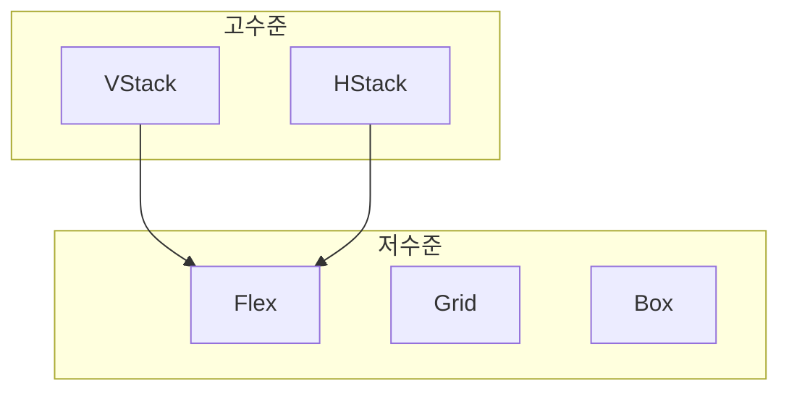

# 달레UI 레이아웃 컴포넌트 개발기

레이아웃은 UI를 만들 때 가장 많이 작성하지만, 가장 명확한 기준을 갖기 어려운 영역입니다.

버튼이나 텍스트는 많은 디자인 시스템에서 이미 정답을 내려주지만, 레이아웃은 매번 개발자가 직접 판단해야 하는 경우가 많습니다.

- flex를 쓸지 grid를 쓸지
- align은 어디까지 허용해야 하는지
- 이 gap이 팀의 기준에 맞는 값인지

이 판단은 코드에 명확히 드러나지 않고, 결국 “이렇게 써도 되나?”라는 질문을 남깁니다.

이 글은 **달레UI에서 레이아웃 컴포넌트를 설계하고 구현하는 과정에서 겪었던 고민과 시행착오** `Box`, `Flex`, `Grid`, `VStack`, `HStack` 같은 기본 레이아웃을 어떤 기준으로 나누고 정리했는지에 대한 기록입니다.

단순히 컴포넌트를 나열하는 글이 아니라, **레이아웃의 판단을 어디까지 시스템이 책임져야 하는가**라는 질문에 대해 달레UI가 선택한 기준과 방향을 공유하고자 합니다.

---

## 🧩 왜 레이아웃 컴포넌트를 만들까?

### 화면을 구성하는 대부분의 시간은 레이아웃에 쓰입니다

디자인 시스템을 사용하는 개발자분들은 버튼이나 타이포그래피보다 **레이아웃 코드를 훨씬 더 많이 작성**하게 됩니다. 버튼이나 타이포그래피는 이미 정의된 컴포넌트를 가져다 쓰면 끝이지만 레이아웃은 매번 어떤 방법을 사용할지 판단해야합니다. 어떻게 배치할지에 대한 선택의 연속이기 때문에, 컴포넌트 중에서도 가장 많은 판단과 고민이 필요한 영역입니다.

그리고 그 레이아웃 코드는 보통 아래와 같은 형태로 반복됩니다.

```tsx
<div
  style={{
    display: "flex",
    flexDirection: "column",
    alignItems: "flex-start",
    gap: "8px",
  }}
/>
```

문제는 이 코드만 보고서는 이 레이아웃이 그냥 기본 구조인지, 아니면 누군가 의도적으로 조정한 결과인지 알기 어렵다는 점입니다.

- 세로 방향이 기본값이라서 그런 건지
- 특정 화면을 위해 일부러 이렇게 맞춘 건지
- 이 간격이 디자인 시스템에서 권장하는 값인지

이런 것들을 코드를 읽는 사람이 매번 짐작해야 합니다. 결국 레이아웃을 작성할 때마다 코드를 짜는 시간보다, 의미를 해석하고 판단하는 데 더 많은 시간을 쓰게 됩니다.

### 같은 레이아웃, 다른 구현

여러 명의 개발자가 함께 작업하다 보면 같은 레이아웃이라도 구현 방식이 조금씩 달라집니다.

```tsx
{
  /* A 개발자 */
}
<div style={{ display: "flex", gap: "8px" }}>
  <div />
  <div />
</div>;

{
  /* B 개발자 */
}
<div style={{ display: "flex" }}>
  <div style={{ marginRight: "8px" }} />
  <div />
</div>;
```

겉보기에는 큰 차이가 없어 보이지만, 이런 작은 차이들은 시간이 지날수록 UI 일관성과 유지보수 비용에 영향을 줍니다.
사용자는 매번 다음과 같은 판단을 스스로 내려야 합니다.

- 이 경우에는 flex를 직접 써도 괜찮을까?
- gap은 어느 정도가 적당할까?
- 이 레이아웃이 팀의 기준에 맞는 방식일까?

이러한 고민이 반복되면, 디자인 시스템을 쓰고 있음에도 오히려 판단 부담은 계속 늘어나게 됩니다.

### 레이아웃 컴포넌트는 일관성 있는 UI를 구현하는 데 필요한 기준을 제공합니다.

레이아웃 컴포넌트의 목적은 새로운 기능을 제공하는 데 있지 않습니다. 대신 다음과 같은 역할을 합니다.

- 잘못된 정렬이나 방향을 선택하지 않도록 돕고
- 의미 없는 spacing 사용을 막으며
- 레이아웃의 의도를 코드에서 바로 읽을 수 있게 합니다

```tsx
<VStack gap="8" reversed align="top">
  ....
</VStack>
```

이 한 줄은 CSS 구현을 나열하는 코드가 아니라, “세로로 쌓고, 이 간격과 정렬을 사용한다”는 의도 표현입니다.
이를 통해 사용자는 더 이상 flex 축을 직접 계산하지 않아도 되고 align과 justify를 헷갈리지 않아도 되며 팀의 스타일 기준을 추측하지 않아도 됩니다

### 그래서, 왜 레이아웃 컴포넌트일까요?

레이아웃 컴포넌트는 더 빠르게 만들기 위한 도구라기보다는, 틀리지 않게 만들기 위한 도구입니다. 사용자는 불필요한 고민을 줄일 수 있고 실수를 할 가능성이 낮아지며 언제나 비슷하고 예측 가능한 결과를 얻을 수 있습니다

이러한 경험이 쌓일수록 디자인 시스템은 “있으면 좋은 도구”가 아니라 신뢰할 수 있는 기준이 됩니다. 이것이 달레UI가 레이아웃 컴포넌트를 제공하는 이유입니다.
**레이아웃에 대한 판단을 개발자 개인에게 맡기지 않고, 시스템이 대신 책임지기 위함**입니다.

---

## 🧠 설계 과정

### 레이아웃 전략: 고수준과 저수준

레이아웃 컴포넌트를 설계하면서 개발 우선순위와 사용성을 고려해서 달레UI는 추상화 수준을 기준으로 고수준과 저수준 레이아웃을 구분했습니다.
VStack이나 HStack처럼 특정 패턴을 빠르게 구현하도록 만든 컴포넌트는 고수준 레이아웃으로, 직관적이고 빠른 개발이 가능하지만 유연성은 제한적입니다. 반대로 Flex, Grid, Box처럼 CSS 속성을 거의 그대로 노출하는 컴포넌트는 저수준 레이아웃으로 더 많은 제어가 가능해 복잡한 레이아웃 구현에 유리하지만 개발자의 실수로 잘못된 스타일링의 가능성이 있습니다.

#### 왜 추상화 수준으로 나눌까?

저수준 컴포넌트는 자유도가 높아 다양한 레이아웃을 구현할 수 있고 고수준 컴포넌트는 저수준을 추상화해 반복되는 패턴을 재사용할 수 있어서 유연성과 확장성을 동시에 높일 수 있습니다.



### 제공할 컴포넌트 선정

레이아웃 컴포넌트는 종류가 매우 다양합니다. Box부터 AbsoluteCenter까지 선택지가 많았고, 달레UI 팀은 이 중 어떤 컴포넌트를 우선 제공할지 결정해야 했습니다.
초기에는 "가능한 한 많은 컴포넌트를 지원해 사용자에게 다양한 선택지를 제공하자는 생각이 있었습니다." 하지만 실제로 사용되지 않는 컴포넌트를 계속 유지하는 것은 의미가 없을 뿐 아니라, 이후 제거 과정에서 break-change가 발생해 사용자 경험이 떨어질 수도 있었습니다.

이러한 이유로, 과도한 확장보다 실제 사용 빈도를 기준으로 컴포넌트를 선별하는 방향이 더 적절하다고 판단했습니다.
우선 마케팅 페이지 개발에서 가장 많이 사용되는 Box, Flex, HStack, VStack, Grid를 먼저 구현했으며, 이후 필요성이 확인되는 컴포넌트부터 단계적으로 확장해 나가는 전략을 선택했습니다.

### 접근성에 대한 고려

달레UI는 접근성을 준수한 디자인 시스템을 목표로 하고 있기 때문에, 레이아웃 컴포넌트도 시맨틱한 구조를 가질 수 있어야 했습니다.

처음에는 아래처럼 role을 부여하는 방식으로 시맨틱을 표현하려 했습니다.

```tsx
<VStack role="header" />
```

하지만 시맨틱 구조는 가능한 한 태그 자체로 표현하는 것이 원칙이기 때문에, role로 의미를 우회적으로 전달하기보다는 실제 HTML 요소를 지정할 수 있도록 as props를 도입했습니다


모든 레이아웃 컴포넌트는 as를 통해 알맞은 태그로 렌더링되도록 설계했으며, 태그만으로 충분하지 않은 경우에만 role로 시맨틱을 보완할 수 있도록 구현했습니다.

---

## 🛠️ 구현 후기

### 1. `VStack` 개발

#### 개발 경험담 from. @hyoseong1994

수직 정렬이 많이 쓰일 것 같아서 VStack부터 만들었습니다.
처음에는 CSS를 그대로 props로 노출하려 했지만, 그러면 고수준 레이아웃이 아니라 그냥 스타일 전달용 컴포넌트가 된다는 피드백을 받았습니다.
그래서 `align`은 start, end 대신 top, bottom으로 이름을 바꾸고, `reversed`라는 boolean props로 방향을 쉽게 바꿀 수 있도록 했습니다.
또한 `as`props를 사용해 main, header, nav 같은 태그로 렌더링할 수 있게 해서 접근성도 고려했습니다.

#### 데모영상

[screen-capture.webm](https://github.com/user-attachments/assets/06838b8c-f230-45b6-9e55-ab75efb0c907)

### 2. `HStack` 개발

#### 개발 경험담 from. @sounmind

직접 레이아웃 컴포넌트를 만들었던 적이 없어서 그 자체로 재밌었습니다.
기존에 만들어진 VStack의 컨벤션을 유지하도록 피드백(수평 방향 정렬을 위한 prop 이름을 정할 때)도 해주시고 기타 여러가지 노력했어요.

#### 데모영상

[blog_layout_2.webm](https://github.com/user-attachments/assets/23fcb8ea-db77-47be-8106-ef194ccfb8cc)

### 3. `Flex` 컴포넌트 개발

#### 개발 경험담 from. @y00eunji

앞서 구현된 VStack, HStack 컴포넌트를 많이 참고해서 Flex 컴포넌트를 구현했습니다. 저 또한 레이아웃 컴포넌트는 처음 만들어보는 경험이었는데, 리뷰를 통해 테스트 코드를 리팩토링하고, 기본값을 수정하며 justify: around 옵션을 추가하는 등 여러 부분을 개선할 수 있었습니다. 같은 레이아웃 시스템 안에서도 VStack/HStack은 의미론적 prop을, Flex는 저수준 CSS 개념을 노출한다는 점에서 컴포넌트 역할에 따라 API 설계가 달라져야 한다는 걸 경험할 수 있어서 재미있었습니다!

#### 데모영상

[blog_layout_3.webm](https://github.com/user-attachments/assets/8a35f9f8-dd6e-41ea-bd34-6d5178646939)

### 결과

- 레이아웃 컴포넌트를 도입한 뒤, 반복되던 스타일 코드를 없애고 Flex, HStack, VStack으로 레이아웃 구조를 일관되게 중앙에서 관리할 수 있게 되었습니다.
  

---

## 🔍 배운 점(개발 우선순위 선택)

### 유사한 컴포넌트 구성

처음에는 “가장 많이 사용하는 레이아웃부터 만들자”는 판단으로 `VStack`와 `HStack`을 먼저 구현했습니다.  
그러나 실제 구현을 진행하면서 세 컴포넌트(`VStack`, `HStack`, `Flex`)에서 **유사한 로직과 스타일 패턴이 반복되는 문제**를 경험했습니다.

- 고수준 컴포넌트끼리 중복된 로직이 발생함

```tsx
{
  /* hstack */
}
return React.createElement(
  Component,
  {
    className: cx(
      hstackVariants({
        align,
        reversed,
      }),
      css({ gap }),
      className,
    ),
    ...rest,
  },
  children,
);
```

```tsx
{
  /* vstack */
}
return React.createElement(
  Component,
  {
    className: cx(
      vstackVariants({
        align,
        reversed,
      }),
      css({ gap }),
      className,
    ),
    ...rest,
  },
  children,
);
```

- 내부 동작 규칙이 분리되어 일관성이 깨짐

```tsx
{/* hstack */}
    align: {
      left: { justifyContent: "flex-start" },
      center: { justifyContent: "center" },
      right: { justifyContent: "flex-end" },
      between: { justifyContent: "space-between" },
      around: { justifyContent: "space-around" },
    },
```

```tsx
{/* vstack */}
    align: {
      left: { alignItems: "start" },
      center: { alignItems: "center" },
      right: { alignItems: "end" },
      stretch: { alignItems: "stretch" },
    },
```

```tsx
{/* flex */}
    align: {
      start: { alignItems: "flex-start" },
      center: { alignItems: "center" },
      end: { alignItems: "flex-end" },
      stretch: { alignItems: "stretch" },
    },
```

결국, **`Flex`를 먼저 설계하고 이를 기반으로 `VStack`, `HStack`을 구성했어야 했다**는 아쉬움이 남았습니다.

### `VStack`, `HStack`을 Flex 기반으로 재구성

초기 구현에서는 각각을 독립적인 컴포넌트로 관리했지만, 이후 Stack류 레이아웃의 근간을 `Flex`로 통합하는 방향으로 재구성했습니다.

- `VStack` → `Flex` + `direction="column"` + `align="center"`
- `HStack` → `Flex` + `direction="row"` + `align="center"`

결과적으로 `VStack`와 `HStack`은 독립적인 구현체가 아닌,  
**Flex를 기반으로 한 명확한 preset 컴포넌트**로 정리되었습니다.

### 코드

```tsx
export const VStack = ({
  children,
  align = "top",
  reversed = false,
  ...rest
}: VStackProps) => {
  return (
    <Flex direction={direction} justify={alignContent} align="center" {...rest}>
      {children}
    </Flex>
  );
};
```

### 결과

- 중복 로직 제거
- 확장성 증가
- 모든 gap/spacing이 동일한 토큰 기준을 따르게 됨

---

## 🧭 앞으로의 방향

레이아웃 시스템은 앞으로도 확장할 부분이 남아 있습니다.

- 중복 로직 최소화, 코드 유지보수성 강화
- 자주 반복되는 UI 패턴 기반의 고수준 컴포넌트 추가
  ex) `AbsoluteCenter` `ScrollArea ` 등 자주 사용되는 UI패턴을 추가할 계획
- 명확한 props 네이밍과 문서화로 AI 친화적인 레이아웃 컴포넌트 구현
  ex) align="top"처럼 의도 중심 네이밍 / “예시 중심” 문서화를 제공해서 AI가 정확한 코드 스니펫을 생성하도록 유도

---

## 🏁 마무리

레이아웃 컴포넌트는 눈에 잘 띄지 않지만, 디자인 시스템의 신뢰도를 가장 직접적으로 좌우하는 영역이라고 생각합니다.

개발자가 매번 판단해야 하는 부분이 많아질수록 시스템은 참고용되고, 시스템이 대신해 줄수록 디자인 시스템은 기준됩니다.

달레UI는 너무 많은 레이아웃 컴포넌트를 제공하기보다는 소수의 필수 레이아웃 컴포넌트만을 제공하여 사용자들이 일관성 있는 UI 구현을 달성하는 데 초점을 맞췄습니다.

이 글에 담긴 설계와 시행착오가 레이아웃 컴포넌트를 고민하는 분들, 혹은 디자인 시스템의 역할을 고민하는 분들에게 참고 자료가 되기를 바랍니다.

각자의 제품과 팀에 맞는 기준은 다를 수 있지만, “무엇을 시스템이 책임질 것인가”를 고민하는 출발점이 되었으면 합니다.

앞으로도 달레UI의 레이아웃 시스템은 실제 사용 경험을 바탕으로 계속 다듬어갈 예정입니다.
